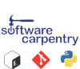

# The workshop website is under construction  
Please come back nearer the time for your workshop or for our current workshops please see [The Newcastle University RSE Team Website](https://rse.ncldata.dev/events) or contact [Jannetta Steyn](mailto:Jannetta.Steyn@newcastle.ac.uk) in the [RSE Team ](https://rse.ncldata.dev/contact)   

### In the meantime, here are links to the training materials for our workshops:
- [Unix Shell](https://swcarpentry.github.io/shell-novice/)
- [Version Control with Git](https://nclrse-training.github.io/git-ultra-novice/)
- [Programming with Python](https://carpentries-incubator.github.io/python-novice-programming-gapminder/)
- [HPC Carpentry Day 1 of 2 - Unix Shell](https://swcarpentry.github.io/shell-novice/)
- [HPC Carpentry Day 2 of 2](https://carpentries-incubator.github.io/hpc-intro/)
- [Introduction to IoT](https://carpentries-incubator.github.io/iot-novice/index.html)
- [Programming with R](https://swcarpentry.github.io/r-novice-gapminder/)

We run Software Carpentries and Carpentries Instpired Workshops.  Find out more about [The Carpentries](https://carpentries.org/)

